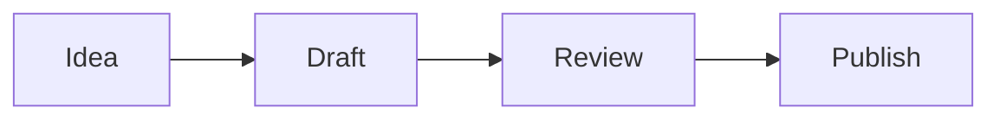

# Rich Note Bodies

The Markdown Tolaria's rich editor renders, and how to write it so it lasts. The editor re-writes the whole body each time the user edits a note. **Durable** Markdown is the set of forms that come back unchanged from that save. Write only durable forms.

## Durable forms

| Element | Write |
| --- | --- |
| Title | `# Title` as the first body line, directly under the frontmatter |
| Headings | `##` to `####`. The table-of-contents panel lists H1 to H3. |
| Emphasis | `**bold**`, `*italic*`, `~~strike~~`, `` `code` `` |
| Highlight | `==text==` is yellow. `==🟢text==` green, `==🔴text==` red, `==🔵text==` blue, `==🟣text==` purple. |
| Bullets | `- item`, nested with two spaces |
| Numbered list | `1.`, `2.`, `3.` |
| Tasks | `- [ ] open`, `- [x] done`, nestable |
| Divider | `---` with a blank line above and below |
| Quote | `> text` |
| Code | A fence with a language label. Always label it. |
| Table | A pipe table, one line per row |
| Link | `[text](https://example.com)` |
| Note link | `[[filename]]` or `[[filename|label]]` |
| Image | `` on its own line |
| File card | `[report.pdf](attachments/report.pdf)` on its own line |
| Math | `$x^2$` inline, a `$$` block for display |
| Diagram | A `mermaid` fence |
| Callout | `> [!type] Title` |
| Dashboard | An `html` fence. See `dashboards.md`. |
| Whiteboard | A `tldraw` fence |

Keep callouts, `$$` blocks, and `mermaid`, `html`, and `tldraw` fences at the top level of the note, with a blank line around each. Nested inside a list they lose their rendering.

## Callouts

```md
> [!warning] Deploy freeze
> No releases until **Monday**. See [[release-checklist]].
> Ask [[jane-doe]] for exceptions.
```

| Use it for | Types (aliases) | Color |
| --- | --- | --- |
| Context, a summary up top | `note`, `info`, `todo`, `abstract` (`summary`, `tldr`) | Blue |
| Advice, a result, a decision made | `tip` (`hint`, `important`), `success` (`check`, `done`) | Green |
| A risk, an open question | `warning` (`caution`, `attention`), `question` (`help`, `faq`) | Amber |
| A blocker, a failure, a defect | `danger` (`error`), `failure` (`fail`, `missing`), `bug` | Red |
| A worked example | `example` | Purple |
| A quotation | `quote` (`cite`) | Gray |

- Write the marker plain: `[!tip]`. A fold marker (`[!tip]-`, `[!tip]+`) turns the block into an ordinary quote.
- The title is plain text.
- The body is lines of inline content: text, bold, links, highlights, inline math, wikilinks. Start every line with `> `. A bare `>` line ends the callout.
- Put a list or a code block after the callout as its own block.

## Math

Rendered with KaTeX.

```md
Inline: the rate is $r = \frac{d}{t}$.

$$
\int_0^1 x\,dx = \frac{1}{2}
$$
```

- Inline math must look like math to be recognized: no space just inside the `$` signs, and either a `\command` or an operator with no long word. `$speed = distance / time$` stays literal; `$\text{speed} = d/t$` renders.
- Money stays literal: `$20`, `$2k`.
- Write display math with `$$` alone on its own lines.

## Mermaid

````md

````

- Any Mermaid 11 diagram type works: `flowchart`, `sequenceDiagram`, `classDiagram`, `stateDiagram-v2`, `erDiagram`, `gantt`, `timeline`, `mindmap`, `pie`, `journey`, `quadrantChart`, `gitGraph`.
- Diagrams use Mermaid's default light theme in both app themes. Rely on shape and labels, and leave colors at their defaults.
- A diagram that fails to parse shows its source with an error. Keep node labels free of unbalanced brackets and quote labels that hold punctuation.
- Start a node label with a word. A label that starts with `1.` or `-` is read as a Markdown list and fails.

## Code fences

- Label every fence. An unlabeled fence gets a language guessed on save.
- An `html` fence is a live rendered block. To *show* HTML source, label the fence `xml`.
- An unlabeled fence whose first word is a Mermaid keyword (`graph`, `flowchart`, `gantt`, …) becomes a diagram. Label it `text` only if it holds something else.

## Tables

- One line per row. A line break inside a cell becomes a space.
- Cells take inline formatting, wikilinks, and `$x$`. Write a literal pipe as `\|`.
- Column alignment is not kept.
- Use a table for a small grid of text. When the rows hold numbers to total, or the user will keep adding rows, use a sheet note (`sheets.md`).

## Images and files

- A path that starts with `attachments/` resolves from the vault root in every note, whatever folder the note is in.
- To add an image, put the file in `attachments/` and reference it. Name it without spaces; if a name has spaces, wrap the path: ``.
- Give one image its own line. A caption is an italic line under it.
- Audio, video, and PDF: a link on its own line becomes a file card that opens the in-app preview.
- Link other vault files with their extension: `[[sample-report.html]]`, `[[views/active-projects.yml]]`.

## Links

- Link a note by its filename without `.md`: `[[billing-rewrite]]`. Add a label when the sentence needs different words: `[[billing-rewrite|the rewrite]]`.
- Link to a heading in the same note with `[text](#heading-slug)`: the heading in lower case, punctuation dropped, spaces as `-`.
- To point at a section of another note, link the note and name the section in the text.

## Whiteboards

````md
```tldraw id="planning-map"
{}
```
````

This places an empty whiteboard for the user to draw on. Give each board in a note its own `id`. Once a board has drawings its fence holds tldraw's own data, so move or delete the block whole and leave its contents as they are.

## What does not last

| Wanted | Write instead |
| --- | --- |
| Underline, text color, centered text | Bold, a highlight, or a callout |
| A collapsible section (`<details>`, toggles) | A heading. The user can fold any heading in the editor. |
| Footnotes | An inline link, or a `## Sources` list |
| A quote inside a quote, a list inside a callout | Separate blocks, one after another |
| An image size or title | An italic caption line |
| Another note embedded in this one (`![[note]]`) | A wikilink |
| A hard line break inside a paragraph | Two paragraphs, or a list |
| Raw HTML or an HTML comment in the body | An `html` fence when it should render; otherwise leave it out |

The editor also normalizes on save: `*` bullets become `-`, `_italic_` becomes `*italic*`, `[!NOTE]` becomes `[!note]`, blank lines between frontmatter and H1 go, and the file ends with one newline. Writing the durable form first keeps the user's git diffs clean.

## Display options

Two optional `_` keys change how one note is shown. Set them when the user or their preferences ask for it.

- `_width: wide` — for notes that are mostly tables, diagrams, or dashboards.
- `_icon:` — an emoji, or a Phosphor icon name in kebab-case such as `rocket`. It replaces the type's icon for this note.

## Long notes

Keep a note under about 16 KB. Above that the editor switches to a simpler parser that can split a multi-line callout or quote into pieces. Split long material into several notes and link them from a hub note.
